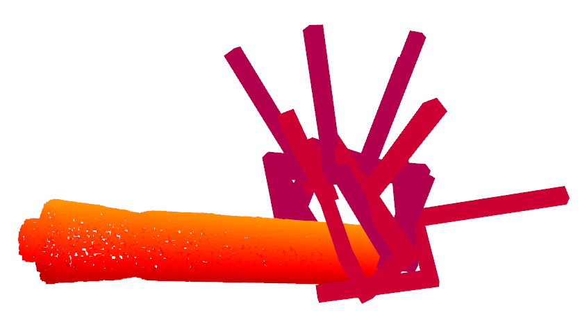

# (Deprecated!!!) Grasp Label Auto-annotation

Object grasp label dense annotation based on graspnetAPI. Use the same annotation format as GraspNet1-billion dataset.

[[GraspNetAPI](https://github.com/graspnet/graspnetAPI)]

## Requirements

- graspnetAPI

## Installation

Get the code.

```bash
git clone https://github.com/rhett-chen/grasp-auto-annotation.git
cd grasp-auto-annotation
```

Install packages via Pip.

```bash
pip install -r requirements.txt
```

Compile sdf generator(if you need to generate object sdf file)

```bash
cd sdf-gen
mkdir build && cd build && cmake ..
make
```

## Usage

### Step1

Organize your data as GraspNet1-billion format. Take [OCRTOC dataset](https://github.com/OCRTOC/OCRTOC_dataset_toolkit) as example:  
| -- ocrtoc  
&emsp;&emsp;| -- models  
&emsp;&emsp;&emsp;&emsp;| -- objectname1  
&emsp;&emsp;&emsp;&emsp;&emsp;&emsp;| -- textured.obj  
&emsp;&emsp;&emsp;&emsp;&emsp;&emsp;| -- textured.ply  
&emsp;&emsp;&emsp;&emsp;&emsp;&emsp;| -- textured.sdf  
&emsp;&emsp;&emsp;&emsp;| -- objectname2  
&emsp;&emsp;&emsp;&emsp;| -- ... ...  
&emsp;&emsp;| -- grasp_labels(to be generated)  
&emsp;&emsp;&emsp;&emsp;| -- objectname1_labels.npz  
&emsp;&emsp;| -- scenes    

### Step2

If object model doesn't contain .sdf file,  generate .sdf from .obj use generate_sdf() or batch_generate_sdf() function in auto_annotaton/annotation_utils.py

### Step3

Set relevant arguments in auto_annotaton/options.py.  The default parameters here are the recommended parameters.

### Step4

Generate object-level grasp pose label.

```bash
cd auto_annotation
python main.py
```

### Step5

Load, save and visualize object grasp poses,  you also need to set relevant arguments in options.py.  The format of loaded grasp poses is same as  GraspNetAPI(`num_grasp*17`).

```bash
cd auto_annotation
python load_grasp.py
```

## Optional step

Generate pickle object dexnet model for fast loading.

```bash
cd auto_annotation
python gen_pickle_dexmodel.py
```

## Results

We show the grasp label annotation results of large_marker object in OCRTOC dataset. When annotating this object, we set num_views=100, num_angles=3,  num_depth=3, and we randomly select only one grasp point for annotaion in the example. 

## Acknowledgement

The process of grasping pose annotation is based on [GraspNet1-billion](http://openaccess.thecvf.com/content_CVPR_2020/papers/Fang_GraspNet-1Billion_A_Large-Scale_Benchmark_for_General_Object_Grasping_CVPR_2020_paper.pdf) ,  many function implementations are based on [GraspNetAPI](https://github.com/graspnet/graspnetAPI).
