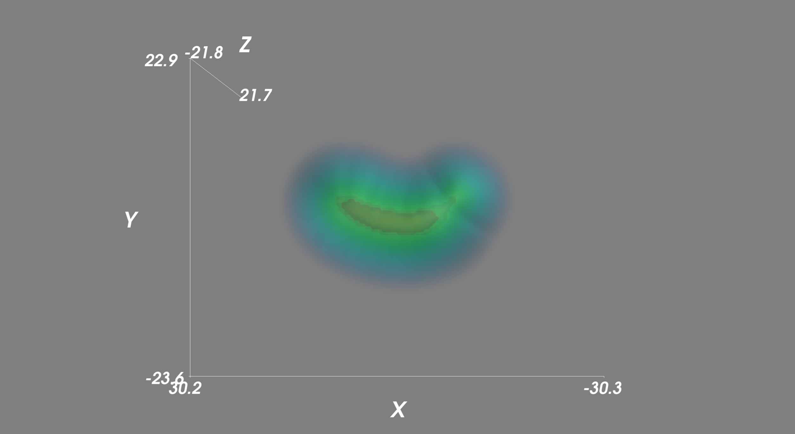

# SDFGen

A utility for converting closed oriented triangle meshes into grid-based signed distance fields.

The output file format is:

\<ni\> \<nj\> \<nk\>

\<origin_x\> \<origin_y\> \<origin_z\>

\<dx\>

\<value_1\> \<value_2\> \<value_3\> [...]

  - `(ni,nj,nk)` are the integer dimensions of the resulting distance field.
  - `(origin_x,origin_y,origin_z)` is the 3D position of the grid origin.
  - `dx` is the grid spacing.
  - `value_n` are the signed distance data values, in ascending order of i, then j, then k.
The output filename will match that of the input, with the OBJ suffix replaced with SDF.

Usage: SDFGen \<filename\> \<dx\> \<padding\>

Where:
  - `filename` specifies a Wavefront OBJ (text) file representing a *triangle* mesh (no quad or poly meshes allowed). File must use the suffix ".obj".
  - `dx` specifies the length of grid cell in the resulting distance field.
  - `padding` specifies the number of cells worth of padding between the object bound box and the boundary of the distance field grid. Minimum is 1.

## Example output

Example python script is provided for parsing and visualizing the generated signed density field.

